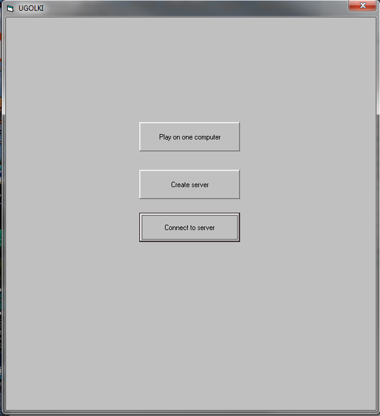
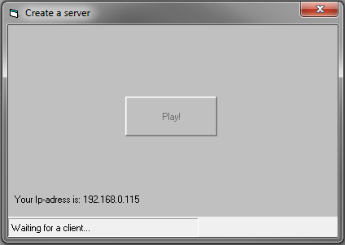
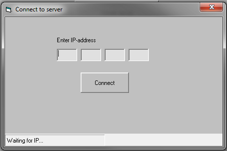
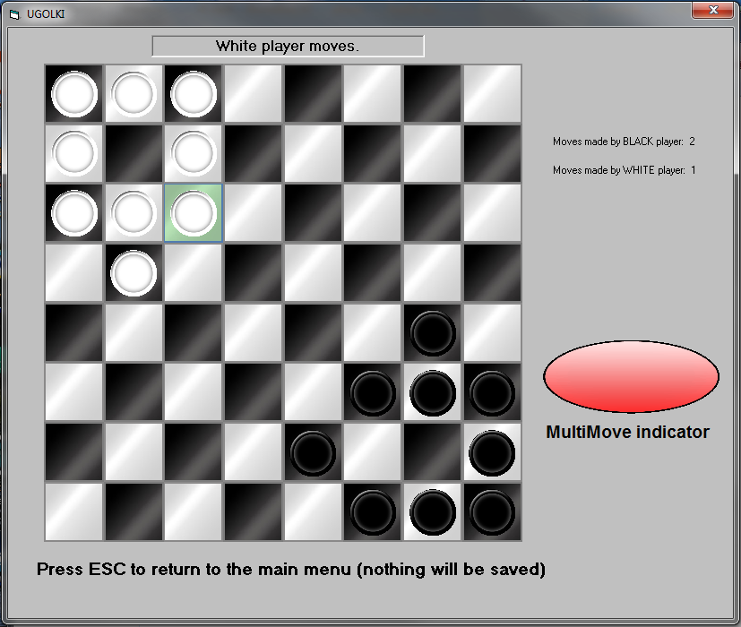
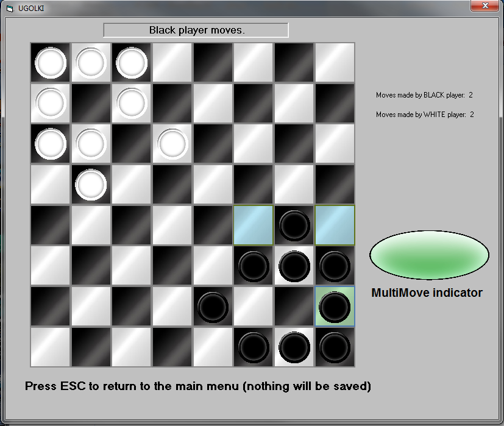

This is my final project for my grade 12 Computer Science course (2013)

#IMPORTANT: TO RUN THE .EXE YOU MUST INSTALL MSWINSCK.OCX !!! 
#The reason is that since I made the program in VB 6, it uses old libraries (VERY old), and modern Windows systems do not have them anymore. 

The students were supposed to pick whatever they like as their project and try to implement it within a given period of time.
I struggled with what to work on. I knew I wanted to make a game, but I didn't know which game exactly. 
So, my teacher gave me an idea about that game Ugolki ( https://en.wikipedia.org/wiki/Ugolki ). 
At first, I thought that it would be boring, but then I got an idea: what if I make it work over a network? 

Also, from the past I already knew the notion of an Object in programming and wanted to experiment in creating my own classes and objects.

As a result, I implemented Ugolki in a way that allows to play either on one computer (switching turns) OR via LAN (no Internet, sorry).

#Main Menu

So, the program allows you to open a server: 

#Server

Or open a client to join a server:

#Client

Once the connection is established (or if you chose to play on one computer), the game will start.

#Gameplay

So, to move a piece you simply click on it, it gets selected and then you click on the cell you want to move it to. If you can not place it on a cell you picked due to the rules of the game, the message will pop up informing you about that.
The rules are simple: 
Your piece can move 1 cell horizontally or vertically or jump over other pieces. 
In order to jump over multiple pieces you have to use the MultiMove feature. 
Simply click on you piece, press SPACE and then pick the cells you want to jump through in the order you choose and then press SPACE again.

#MultiMove in action

