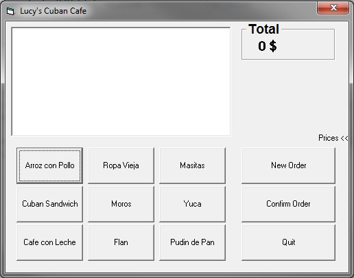
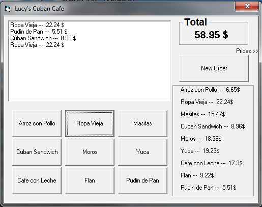

This is one of the programs I made for my grade 12 Computer Science course (2013).

The goal was to make a menu for ordering items in a cafe.
After finishing the project I decided to play with the components of the form and made some cool animations with them because... 
Well, because I could and had too much time during class.

The program was written in VB6 and I have zero clue how to save the code outside of the project file, 
so I put it into "Lucy's Cuban Cafe.txt"

Download the .exe file and play with it all you want. 

Hover over "prices" tag in order to open or close the price menu.

